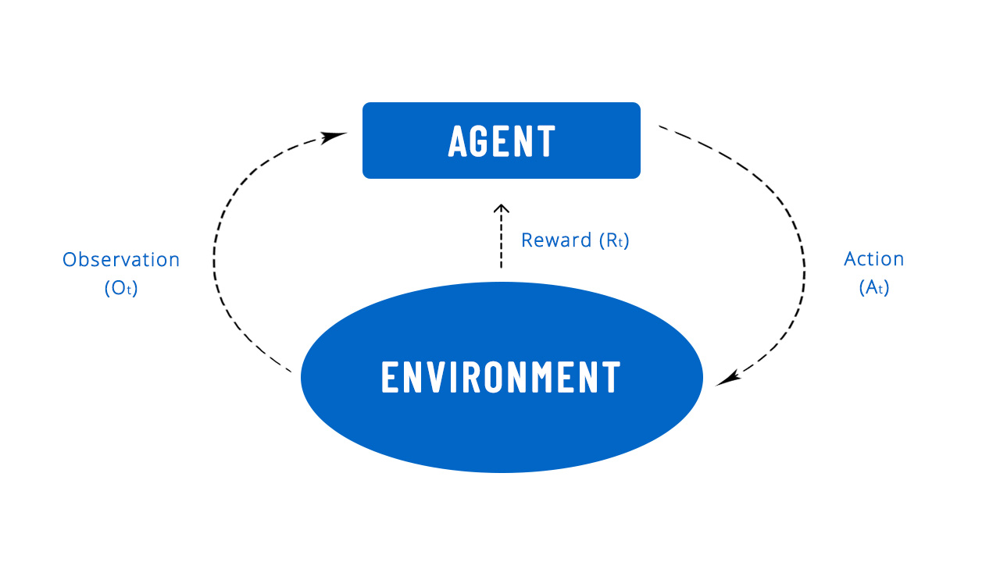

<!-- PROJECT LOGO -->
 

  
  <h6 align="center"; display: flex; justify-content: center>Implementation of MADDPG (Multi-Agent Deep Deterministic Policy Gradient) and QMIX (Monotonic Value Function Decomposition), and combining it with EA algorithms & applying to different Benchmarks (the source code belongs to paper (Evolution-Guided Policy Gradient in Reinforcement
Learning. I only implemented QMIX and MADDPG from scratch and integrated it with their code) </h6>

 
 

